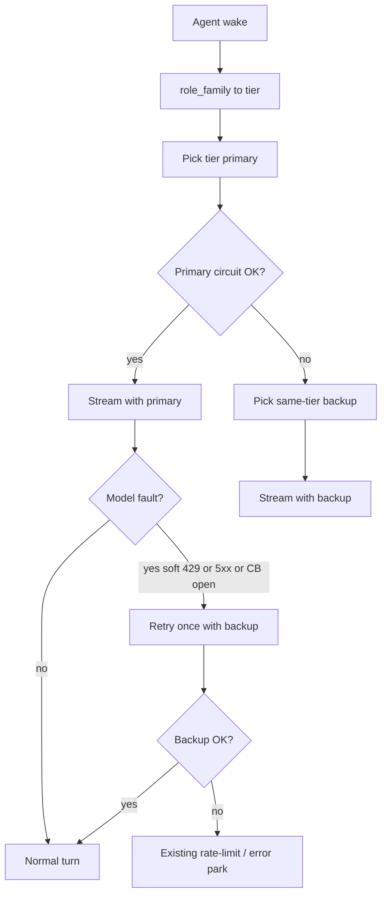

# 模型分级 + 同级故障切换

## 一、对照 CLAUDE 审计 TEST22 复盘（结论）

报告方法论（治根 / 检测层优先 / 提示词零新增）与 [CLAUDE.md](CLAUDE.md) 一致。六条问题定性大体正确，但有几处需校准，避免按过时文档误修：

| 报告项 | 审计结论 | 依据 |
|--------|----------|------|
| P0-1 429 进 `chat_messages` | **成立** | [`agent.py`](apps/hiveweave-py/src/hiveweave/agents/agent.py) `_handle_error` 把 `[ERROR] …` 以 `role=assistant` 写入 streaming 消息；会进 LLM 历史 |
| P0-2 未解析 reset | **成立，且 CLAUDE 偏乐观** | [`parse_quota_reset`](apps/hiveweave-py/src/hiveweave/llm/retry.py) **只读 header**；Ark body 里的 `reset at 2026-07-27…` 未解析。CLAUDE 写的 120s cooldown / park 已有半套，但挡不住本次「固定 15min 空转」 |
| P0-2「熔断器形同虚设」 | **半对** | per-provider `circuit_breaker` 仍会 `report_failure`；真正缺的是 **key/项目级配额熔断** + 错误不进对话史。不是 breaker 代码死了 |
| P0-3 停机仍被派工 | **成立** | disposition 未接入 dispatch/QA 选派 |
| S5 项目级配额熔断 | **仍必要** | 与本次「分级切换」互补：同 key 周配额耗尽时，同级备选若共享账号也救不了 |
| CLAUDE「Ark 双通道 round-robin」 | **与分级目标冲突** | [`pick_from_pool`](apps/hiveweave-py/src/hiveweave/services/model.py) 对 **全部** `is_active` 轮询，会打穿「管理层用好模型」 |

**已有可用脚手架（勿重造）：**

- hire 已读 `default_coordinator_model` / `default_executor_model`（[`org_tools.py`](apps/hiveweave-py/src/hiveweave/tools/org_tools.py)）——仅招聘时绑定，运行时仍被全池 RR 覆盖
- `llm_models.fallback` 列已存在（[`meta.py` 迁移](apps/hiveweave-py/src/hiveweave/db/meta.py)）；streamer 在 **circuit open** 时已能切 fallback（[`streamer.py`](apps/hiveweave-py/src/hiveweave/llm/streamer.py)）——但缺「首次失败立即同级切」+ 缺 tier 约束
- 蓝图已预留 `model_tier`（[`docs/AI工程组织_MVP蓝图.md`](docs/AI工程组织_MVP蓝图.md)）

**复盘 P0（S1/S5/S2）不在本轮实现范围**，但分级切换不能替代它们；同 key `AccountQuotaExceeded` 仍要靠项目级 park + body reset 解析。

---

## 二、目标行为（本轮）

**分级成员（默认）：**

- `management`：CEO + Coordinator（好模型）
- `executor`：Executor + QA + HR（便宜模型）

**每级两个槽位：** primary（优先）+ backup（同级备选）。不跨级降级/升级（避免执行层偷用管理层额度，也避免管理层掉到便宜模型 silently）。

---

## 三、实现方案

### Phase 1 — 先分等级（配置真相源）

1. **`llm_models` 增加 `tier` 列**（`TEXT`：`management` | `executor` | NULL）  
   - 迁移：[`db/meta.py`](apps/hiveweave-py/src/hiveweave/db/meta.py) 的 column-ensure 列表  
   - CRUD：[`services/model.py`](apps/hiveweave-py/src/hiveweave/services/model.py) create/update/list 透出 `tier`；`fallback` 写入路径补齐（列已有、API 写入不完整）

2. **`global_settings` 四个键（显式主备，避免靠顺序猜）：**
   - `model_tier_management_primary` / `model_tier_management_backup`
   - `model_tier_executor_primary` / `model_tier_executor_backup`  
   值存 `llm_models.id`（或稳定 `name`）。启动时若未配置，用现有 `default_coordinator_model` / `default_executor_model` 回填 primary，backup 可空。

3. **角色 → 等级：** 在 [`policy.py`](apps/hiveweave-py/src/hiveweave/services/policy.py) 旁新增小函数 `model_tier_for_agent(agent) -> "management"|"executor"`，基于现有 `infer_role_family`（ceo/coordinator→management；其余→executor）。

4. **hire / 项目 seed：** [`org_tools.py`](apps/hiveweave-py/src/hiveweave/tools/org_tools.py) + [`api/projects.py`](apps/hiveweave-py/src/hiveweave/api/projects.py) 改为按 tier 写 `agents.model_id = primary`，不再「随便挑一个 active」。

5. **关掉打穿分级的全池 RR：** 将 `pick_from_pool(preferred)` 改为 `resolve_model(agent_or_tier, preferred=…)`：
   - 只在该 tier 的 primary→backup 链上解析
   - `model_pool_enabled` 若仍开，**仅**在同 tier、同角色的多 channel 间可选（本轮默认：**关闭跨模型 RR**，严格主备）

### Phase 2 — 同级故障自动切换

触发条件（结构化，不扫自然语言）：

- circuit breaker open（已有）
- `is_rate_limit_error` / 5xx / provider 不可达（扩展：首次失败同 turn 再试 backup **一次**）
- **同 key / 同账号配额耗尽**：若 backup 与 primary 的 `api_key` 指纹相同 → **跳过切换**，直接走现有 park（避免假切换空转）；不同 key 才切

落点：

- [`agents/agent.py`](apps/hiveweave-py/src/hiveweave/agents/agent.py) `_get_model_config`：按 tier 解析 primary；记录本 turn 已用模型
- 流式失败路径：若尚未试过 backup 且 backup 可用且 key 不同 → 用 backup 重跑本轮 LLM **一次**；成功则打点 `model_failover`，不把 ERROR 当正常业务写进历史（与复盘 S1 对齐的最小切口：failover 成功则不 finalize `[ERROR]`）
- [`streamer.py`](apps/hiveweave-py/src/hiveweave/llm/streamer.py) circuit fallback：校验 fallback 的 `tier` 与当前一致，否则拒绝跨级

### Phase 3 — 可观测 + 回归

- `GET /api/debug/metrics` 增加：`model_failover_count`、`model_failover_skip_same_key`
- 单测：`model_tier_for_agent`；`resolve_model` 主备顺序；同 key 跳过；circuit open → 同级 backup；跨级 fallback 拒绝
- 更新 CLAUDE「Ark 双通道」段落：改为 **按 tier 主备**，删除「全 active round-robin」表述

---

## 四、刻意不做（本轮）

- 复盘 S1 全文分流 / S5 项目级配额熔断 / S2 派工排除停机（单独排期；与 failover 互补）
- 三档以上 tier、按任务动态升配
- 跨级自动降级（executor 挂了去偷 management）

---

## 五、建议配置示例（落地后）

- management primary：质量更好的模型（如付费/高配额通道）  
- management backup：另一家或另一 key 的同级模型  
- executor primary / backup：便宜通道（例如现有 Ark Plan + Coding **仅当 key 不同** 才有 failover 价值）
