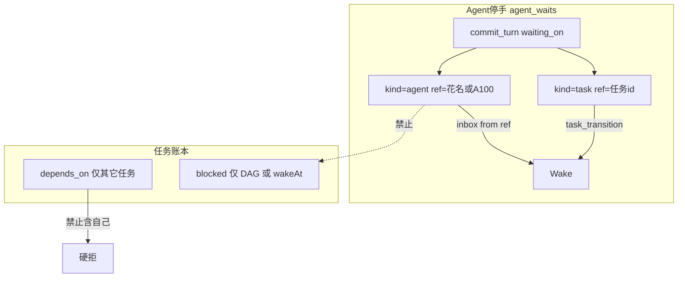

# 平台疏通（DSH_06 根因，审计修订稿）

不操作 `HiveTestProject/TEST_DSH_*`。下文用 TEST_DSH_06 只举例。

**DSH_06 场面：** 归零 A098 → 青梧 A100 → 星野 / Aria / 蛋炒饭。P3 `bcf2ec48` 自指 blocked；蛋炒饭等青梧 waive；青梧 notify「不 waive」；wait 不清。cancel 后补提 `44ea9d1c`。伞 BUILD 套 `code_audit_unit`，青梧求 waive；归零 mine 空 → 拒并 complete。凭证 `407ec944` 短号查不到。截图与 `assert_visual` 路径对不上。

原则：**疏通优先**。唯一新硬挡是 `depends_on` 禁止自指（数据合法性兜底：它写进了解封机器，会占死 VERIFY 串行锁）。

**审计认定必须保留、禁止后人「优化」掉：**

- 不给 tasks 加 `waitingOnAgentId`（人合同与任务 DAG 两本账）
- notify 清 wait **不扫正文**（语言无关）
- `inbox.named_tasks` 只用结构化 `task_id`
- CEO waive 仍可不附 evidence
- 禁自指是合法性兜底，不是行为管制

**审计已核对的代码事实（落地时用这些行号）：** `block_task` 无自指检查；notify 默认不触 wait（[`inbox.py`](apps/hiveweave-py/src/hiveweave/services/inbox.py) 约 538–548 行）；义务排除 blocked；`verify_ids` 定义约 477 行，task_id mismatch 拒绝在约 539 行；HIVE 截图无路径时默认是 workspace 下的 `screenshot.png`（[`browse_tools.py`](apps/hiveweave-py/src/hiveweave/tools/browse_tools.py) 231 行），**不是**「HIVE 默认落 `agent-browser/tmp`」——那是 CLI 落点与 HIVE 假设不一致。

---

## 落地顺序（风险驱动，倒排）

短 ID 爆炸半径最大，**不得**为了「测试好写」排第一。测试在短 ID 合入前继续写 UUID。

1. **3a 自指 + 3b 清 wait**（小、隔离、立刻解死锁）
2. **账本分栏**
3. **凭证 / 截图 / 伞闸**
4. **提示词**
5. **短 ID 垫底**，`HIVEWEAVE_SHORT_IDS` 开关；默认关
6. **code-review 两批**：先行为批，再短 ID 迁移批（旧库兼容 + 双格式查找）

---

## 3a. 禁止 `depends_on` 指向自己

**要解决什么：** `blocked` 必须带 `depends_on` 或 `wakeAt`。等人时代理把本任务 id 填进 DAG，骗过「有自动解封路径」。这条边永远不会被别人关掉，还占 VERIFY 串行锁（自指 blocked 被当成 in-flight）。

**DSH_06：** P3 `bcf2ec48` 的 `depends_on=[bcf2ec48]`。后来只能 cancel 再补提。

**改法：** [`lifecycle.py` `block_task`](apps/hiveweave-py/src/hiveweave/services/tasks/lifecycle.py) 解析后含本任务 id → `ValueError`。回执：等人用 `commit_turn(waiting_on=[{kind:agent,...}])`，任务保持 running。submit / `update_task_status` 同步这句话。指向**其它**任务仍可 blocked。不加 `waitingOnAgentId`。

---

## 3b. 匹配来信清 `kind=agent` wait（notify 也算）

**要解决什么：** 等人写了 `kind=agent`，对方 notify（`wake=0`、无 `replyTo`）已决，收件人不醒、wait 不清。

**DSH_06：** 蛋炒饭 `ref=青梧`；青梧 notify「不 waive」。

**实现契约（审计补丁，原计划会翻车）：**

- **判定与清除同源。** 今天 `event_matches_waits` 用 [`_ref_matches_sender`](apps/hiveweave-py/src/hiveweave/services/wait_contract.py)（含 `len>=4` 前缀互撞），[`clear_waits_matching_ref`](apps/hiveweave-py/src/hiveweave/services/wait_contract.py) 却是 `ref = ?` 精确等值 → 人醒了 wait 还挂着。改为：先把 wait.ref 与发信人**都解析成 `agents.id`**（花名 / `A100` / uuid 走现成 org resolve），匹配与 UPDATE 都用这个 id。禁止再用前缀互撞当唤醒条件。
- **清除时机：唤醒接纳时**，与 [`agent.py`](apps/hiveweave-py/src/hiveweave/agents/agent.py) `_CLEAR_WAIT_SOURCES` 同轨（`source=message_from_ref`）。**不要**复用现在的 `clear_waits()` 全清——那会干掉旁边的 `bg-bash-` wait。接纳时只 `clear` 匹配到的那几行。`wait_satisfied` 继续 `clear_waits=False`。
- **send 时不清。** 只在收件人被接纳进 chat 时清，避免「信发出去了但 agent 仍 parked、合同已标 cleared」的双态。
- **park 穿透：** 收件人 parked / 默认 notify 不醒，但存在未清的 `kind=agent` 且 ref 解析后等于发信人 → **仍要唤醒**（列入 park 豁免：匹配等待合同的来信）。这是「等人来信」的本义，不是扫正文。
- **`WAIT_WITHOUT_ASK` 不放宽。** notify 能清 wait，不能代替「等人之前必须先 ask」。`commit_turn(waiting, kind=agent)` 仍须本回合已向对方发过带回复契约的消息。蛋炒饭那次是先问再等，notify 应清；没问就等仍弹回。

`kind=task`：仅 `task_transition` 或该信结构化 `task_id` 命中才清。

---

## 2. 账本分栏

**要解决什么：** 只有 `get_actionable_obligations(自己)` 且排除 blocked。提示词教信这份 → CEO 把 mine 空当成组织清账。

**DSH_06：** BUILD 在青梧手上；P2/P3 不是归零创建、blocked 不进义务。归零 complete。

**改法：** [`platform_state.py`](apps/hiveweave-py/src/hiveweave/services/platform_state.py) 三栏，上限约 40，带 `truncated`：

- `ledger.mine`：现义务；标题「你的待办」
- `ledger.scope`：CEO = 项目内未关闭（含 blocked）；中层 = 自己创建的 + **递归下属** assignee（用 [`get_all_descendants`](apps/hiveweave-py/src/hiveweave/services/org.py)，不要只 `get_subordinates` 一层——一层在 DSH_06 够用，嵌套中层会再演「看不见就没有」）
- `inbox.named_tasks`：未读信结构化 `task_id`

**截断：** scope **blocked 优先**，其次最近 `updated_at`。被截时附状态计数（`blocked` / `running` / `submitted` / …），避免专为治「看不见」的栏把最老的 blocked 裁掉。

文案写死：mine 空 ≠ 组织无任务。

---

## 4. 凭证、截图、伞闸（审计重写）

### 4.1 凭证：worktree HEAD + 放行矩阵

**要解决什么：** `verify_ids` 死绑 `task_id`（约 539 行）。cancel 补提后旧票作废。原计划用「commit 是当前分支祖先」会继续堵死旗舰场景：worktree 一人一棵，**分支按任务算**；补提后若从 main 重拉，旧 `commit_hash` 不在新分支历史上。

**DSH_06：** 补提 `44ea9d1c` / `7785541b`。

**判定基准：** 该 agent **当前 worktree 的 HEAD**（他站着的那棵树），不是「新任务分支名」。祖先检查**仅限带 `commit_hash` 的行**（`test_run` / `browse_e2e` / `visual_check` / `code_audit` 等）。

**分支延续（疏通，配合补提）：** cancel 后同一 agent 开新任务，**不要默认从 main 新建分支丢掉旧提交**；继续当前 worktree HEAD。若调用方显式切到与旧历史无关的分支，旧票 commit 对不上 HEAD → 拒绝（代码已经不是那次跑测时的树）。

**无 `commit_hash` 的种类**（如 `doc_review` 未写入 hash）：**不做**祖先判定；只走矩阵里的人/任务维。不得把「缺 hash」当成通过，也不得当成「树不对」——缺 hash 时 commit 维记 `skipped`，其余维照常。

**显式 `attestationIds` 放行矩阵（写死，waive 只放宽任务绑定）：**

- 同人、异任务：允许（补提 / cancel 重开），须未过期、exit=0；有 hash 则须为当前 HEAD 或其祖先
- 异人、同任务：允许（现行 P2-4 同任务池：中层引 assignee 的测试票）。**禁止**在 waive/verify 上新增「evidence 必须是 waiving agent 自己」——现行 [`waive.py`](apps/hiveweave-py/src/hiveweave/tools/tasks/waive.py) 查的是 kind/task 绑定/exit，**不查** evidence 的 `agent_id`
- 异人、异任务：拒绝（这才是跨人偷票）

自动挂载仍优先同任务 id。CEO waive 仍可不附 evidence。

中层 waive：短号查找（行为批先做 **精确或唯一前缀**，见下）；任务绑定维按上表放宽；**不要**把 submit 的「同人」套到 waive 上。

行为批即可修旧项目：[`attestation.get`](apps/hiveweave-py/src/hiveweave/services/attestation.py) 今天精确匹配所以 `407ec944` 失败。开关关上时：先精确，再唯一前缀；多行则报歧义，不猜。

### 4.2 截图：修 CLI 与 HIVE 假设不一致

**根因（审计更正）：** HIVE 无路径时假定 [`screenshot.png`](apps/hiveweave-py/src/hiveweave/tools/browse_tools.py) 在 workspace。agent-browser CLI 无路径时可能写到自己的 cwd/`tmp`。文件不在 HIVE 假设处 → `assert_visual` 找不到或拒工作区外。不是「HIVE 默认落 tmp」。

**改法：** 调用 CLI 时**始终**写入显式工作区相对路径（例如 `.hiveweave/reports/<short_id>/shot-<stamp>.png`），不要依赖 CLI 默认落点。回执只给这条相对路径。文件不存在：失败并提示「按回执路径重截」，不要静默去 `agent-browser/tmp` 捞。`assert_visual` 继续拒工作区外。

### 4.3 伞任务闸 + 回执认伞

总包不要 `code_audit_unit`；MAIN 验收 `milestoneVerify=true`。不从标题猜 BUILD。

被闸时回执须识别伞/总包（有子任务或 `milestoneVerify`），十行内写：**总包用 `docs` 或 milestone QA，不要抄叶子闸、不要向 CEO 求这张叶子票。** 缺这句，青梧仍会撞门求 waive。

---

## 5. 团队提示词

与行为同一批。identity 只改等待/账本/id 段。

- [`identity.py`](apps/hiveweave-py/src/hiveweave/prompts/identity.py)：一张 wait 表；等人先 ask 再 `kind:agent`（`WAIT_WITHOUT_ASK` 仍硬）；等活用 `kind:task`；submit 被闸保持 running；mine ≠ scope。短 ID 开关关上时不要提前教「照抄 8 位」当唯一真相——教「照抄回执上的整段 id」；开关打开后再写 8 位。
- [`coordinator.py`](apps/hiveweave-py/src/hiveweave/prompts/coordinator.py)：看 `ledger.scope`；删「完整 UUID」；伞闸；等人不要 `dependsOn`。
- [`executor.py`](apps/hiveweave-py/src/hiveweave/prompts/executor.py) 约 383–387：blocked 只等其它任务 / wakeAt；截图抄回执相对路径。
- schema：`commit_turn` / `update_task_status` / `get_platform_state` / `waive_attestation` / `browse`。

[`CLAUDE.md`](CLAUDE.md) / [`AGENTS.md`](AGENTS.md) 短句。不写评测流水。

---

## 1. 短 ID（最后做，带开关）

**要解决什么：** 回执截 8 位、查找要 36 位 UUID（`407ec944`）。终局仍是：代理看得见的号 = 主键。但按原计划无开关、无改 `canonical_task_id`，**会把 claim/submit/review 全部打成歧义**。

**为什么垫底：** [`canonical_task_id`](apps/hiveweave-py/src/hiveweave/services/attestation.py) / `_UUID_RE` / `_HEX_REF_RE` / `_is_full_uuid` 假定 task id 是 UUID；8 位 hex 走 [`require_task_id`](apps/hiveweave-py/src/hiveweave/services/tasks/crud.py) 的 `LIKE 'ref%'`，会命中任何以这 8 位开头的 **legacy UUID** → 伪歧义。`agent_waits.ref`、`depends_on` JSON、evidence 数组新旧共存会**静默**坏。`_migrated` 是内存 set，重启即丢。[`compute_branch_name`](apps/hiveweave-py/src/hiveweave/services/git_worktree/naming.py) 用 `task_id[:8]`，新 8 位 id 可能撞上旧 UUID 前 8 位。查重-插入有 TOCTOU。前端 [`TaskPicker.tsx`](apps/web/src/components/timeline/TaskPicker.tsx) 有 `slice(0, 36)` / `slice(0, 8)`。

### 新旧判定与灰度

- env **`HIVEWEAVE_SHORT_IDS`**（config：`short_ids: bool = False`）。默认关：铸造仍 UUID，查找走「精确 + 唯一前缀」（行为批已上，旧项目双号病至少能查）。
- **新项目判定：** 创建项目时若开关开，在 **meta `projects` 表写死** `id_format=short8`（持久化，不是 `_migrated` 内存）。该项目此后一律短号铸造。开关关时创建的项目 `id_format=uuid`，永不自动改铸。
- 旧项目打开新代码：表能开；查找兼容双格式；**不改写已有 UUID 行**。无自动迁移、无回滚需求（没改写）。
- 禁止「打开新代码就把旧库当短号主键用」。

### 查找（改造清单必含）

`canonical_task_id` / `resolve_task_id` / `require_task_id` / `attestation.get`：

1. 精确匹配 `id = ?` 永远第一（8 位行与 UUID 行都走这里）
2. **仅当**无精确命中，且 ref 长度为 8–32 hex、且**没有**已存在的等长短号行时，才允许对 **UUID 形**（带连字符或 32 hex）做唯一前缀
3. 一旦精确命中短号主键，**禁止**再 `LIKE` 到 UUID
4. 歧义 → 报错列出候选，不猜表

按字段进表：`taskId` 只查 tasks，`attestationId` 只查凭证。

JSON / 多态列：wait.ref 按 `kind` 解析（agent → org resolve；task → 上列任务查找；job → 精确 job id）。`depends_on` 存解析后的主键，读时同样走 canonical。

### 铸造

[`ids.py`](apps/hiveweave-py/src/hiveweave/ids.py) 仅 `id_format=short8` 的项目调用。`INSERT OR IGNORE` + UNIQUE（先例 [`team_chat_dedupe`](apps/hiveweave-py/src/hiveweave/db/schema.py)）。碰撞重试。铸造时还须不与同表已有 UUID 的 `[:8]` 撞车（护 `compute_branch_name`）。

看得见才铸短号：任务、凭证、inbox/`replyTo`、wait、question、alarm、todo、verification_case、work_log、memory、charter、handoff；offturn `bg-bash-`/`bg-sub-` + 8 位。人仍 `A100`。`agents.id` / `project_id` 不改、不进回执。

### 核对清单

- `compute_branch_name`：短号用整段 id；legacy 仍 `[:8]`；mint 已防撞
- 前端 TaskPicker / timeline 切片：8 位 id 不要再加 `…` 当成截断
- 所有「Pass the full UUID / 完整 UUID」提示
- 约 30+ `uuid.uuid4()` 铸造点只改**代理可见**那些；run_ledger / chat_messages / token_meter 不动
- 短 ID 合入后再改测试断言（此前行为测继续 UUID）

---

## 6. 测试与两批 review

**行为批（仍 UUID 夹具）：**

- `test_block_self_dependency.py` ← `bcf2ec48`
- `test_wait_notify_clears_agent_wait.py`：notify 无 `replyTo` → 唤醒且匹配 wait 已 clear；`bg-bash-` wait 仍在；判定用解析后的 agent id；parked 收件人也会被叫醒
- `test_platform_state_scope.py`：CEO mine 空、scope 含下属 blocked；截断时 blocked 仍在或计数里有 blocked
- `test_attestation_reuse_commit.py`：同人异任务 + HEAD 祖先通过；从无关 main 重拉则拒；异人同任务通过；异人异任务拒；`doc_review` 无 hash 不走祖先
- `test_browse_screenshot_workspace.py`：无路径时 argv **含**工作区相对路径；不依赖 CLI 默认落点
- `test_umbrella_gate_hint.py`：总包被闸回执提到 docs / milestone，不教叶子 `code_audit_unit` 去找 CEO
- 行为批 **code-reviewer**（含 20 行门槛）

**短 ID 批（开关开 + 新项目夹具）：**

- `test_public_ids.py`：8 位主键；`LIKE` 不会把短号解析成 UUID；与 UUID `[:8]` 撞车时重试；回执无 36 位 UUID（agent/project 主键除外且不得出现）
- `test_short_ids_flag_off.py`：旧项目 `id_format=uuid` 仍铸造 UUID，前缀查找仍唯一命中
- 短 ID 批 **code-reviewer**，额外审：旧库打开不静默坏、双格式查找、TOCTOU/UNIQUE、分支名

改动超过 20 行仍按仓库规矩派子代理审计。后端重启后：行为修对所有项目生效；短号只对 `id_format=short8` 的新项目生效。
