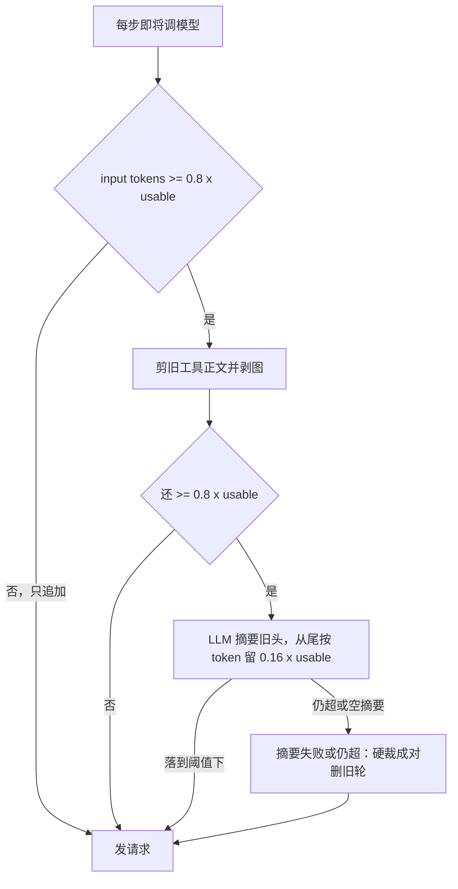

# 平台改进实施计划

来源：DSH 循环分析、[.trae/documents/平台通用改进计划.md](.trae/documents/平台通用改进计划.md)、s3-clone_03 账本。二次审计认定根因成立；口径已按该审计修正。

## 职责（用户口径，不得偏离）

- **叶子**：对自己写的代码负责。派工带的 `submitGate` 是这块代码的自证（unit / 模块视觉 / code_audit），不是全站验收。
- **中层**：对下属交上来的代码负责。审叶子证据，必要时抽看 worktree，自己 merge；整体测试由中层排期，派给 QA。
- **QA**：负责测。中层确认里程碑已合 **MAIN** 后派一条完整版；测试只在 MAIN，不在叶子 worktree 跑全站。
- **CEO**：只看和审大家交来的证据包（kind 跟任务 gate / 里程碑 QA 走）。不读业务源码、不合叶子树、不自己补测。

叶子自证 ≠ QA 测试。clone_03 的错是把「审查方必须 test_run / 每次 merge 都 E2E」叠在中层和 CEO 头上。

## 口径（以此为准）

- **证据闸要改代码**：扩 `POLICY_REQUIRED_KINDS` / `REVIEWER_REQUIRED_KINDS`，派工写入 `policy_id`。不摘 CEO 的 `SOURCE_READ`、不 deny `read_file`。
- **不是「只往已有四个 policy 塞新名」。** 现枚举只有 `docs_only` / `ui_browser_e2e` / `generic_tests` / `coordinator_review`。`docs`→`docs_only`，`unit`→`generic_tests`，`module_visual`→现有 `ui_browser_e2e`（submit 要 browse+visual，审查方可 consume browse/visual）。**新政策**是带 `code_audit` kind 的组合（及停用默认 `coordinator_review`）。`attest_doc_review` / `assert_visual` / `request_code_audit` 是工具，不是 policy。
- **CEO 证据包不写死 `test_run`。** 认该任务 policy 的 kind。clone_03 全库 test_run=0、CEO 26 次 waive，对应 `coordinator_review` → 审查方只要 `test_run`。
- **叶子 browse 不是默认义务。** 仅 `module_visual`（`ui_browser_e2e`）才做模块视觉；长循环 `spawn_subagent`。共享块 `[identity.py](apps/hiveweave-py/src/hiveweave/prompts/identity.py)`「无 browse = UI 未验收」必须一起改，只改 `executor.py` 不够。
- **不再默认每次 merge spawn `VERIFY:`。** QA 只测中层确认已上 MAIN 的里程碑完整版；标题可用 `VERIFY:` 沿用串行锁。
- **CEO 不合叶子 worktree。** 提示词写明；本次不加 MERGE 硬门。
- **VERIFY 占锁（2026-08-11 后）：** 无 assignee 的 blocked、无解封路径的 parked **不占锁**。占锁的窄分支才是 `blocked + 有 assignee + depends_on 非空`。仍禁止对 `VERIFY:` 自动 blocked，测试按新口径写，别测「任何 blocked VERIFY 都占锁」。
- **长循环锯齿对齐 DSH 机制，不是对齐那张 128K 示意图。** DSH 源码（`deepseek-harness` compaction-basic）：每步 `agent/pre-step` 量 token，`≥ floor(contextWindow × 0.8)` 才压；先剪过长 tool result，仍超则 LLM 把旧头换成一条摘要，从尾往前留 `floor(contextWindow × 0.16)` 原文。1M 上是 800K 起齿、落到约 160K。图里 128K 线是示意小窗，不是 DSH 1M 默认。HiveWeave 思考预算会从输入里扣走，**不能**等 800K（会先 400）；触发/保留按 **可用输入** `usable`（`context_window - max_output - 20K`）的 0.8 / 0.16。跨回合 `[compaction.py](apps/hiveweave-py/src/hiveweave/conversation/compaction.py)` 仍是 70%+冷却，**不**当步边界入口。

## 否决

- 50/80 轮硬帽（生产 600；中轮提醒 round 480；`commit_turn(in_progress)` 不切 turn）
- 打开 session wall clock 默认、改回 WAL（代码已是 DELETE）、doom loop 3/5/8、executor 自动抢单
- 从任务描述正则猜「必须 E2E」
- 叶子 worktree 跑全站集成；取消 QA 岗；放宽 VERIFY 三方隔离
- 把「0.8×1M 能压掉夸克 367K」当验收（DSH 自己也是 800K 才落齿；那次 367K 两条线都没碰到）。要的是碰到阈值后的锯齿，不是把窗改成 128K

## 要做

### 1. 长循环锯齿（对齐 DSH）+ 按标签 spawn 视觉

对照 deepseek-harness compaction-basic：锯齿来自每步检查 + 0.8 起压 + 摘要旧头落到约 0.16，不是另设 128K 工作窗。

两层不要混：

- **跨回合**（已有）：一轮 `chat()` 收工写入 `conversation_turns` 后，[`store.py`](apps/hiveweave-py/src/hiveweave/conversation/store.py) `_maybe_trigger_compaction`（70% + 300s 冷却）。工具循环当中**不会**走这里——193 步的消息只活在 streamer 内存里。
- **循环内**（已有判断、几乎不压）：每步已调用 `_trim_context_if_needed`，但要到 `0.95×usable`（约 589K）才 prune/硬删。所以看起来像「只在下一轮对话才压缩」。

本项不是「从零加上循环内判断」，而是：**判断还在每步，把真正压缩（LLM 摘要旧头、留 0.16 尾）提前到 `0.8×usable`，对齐 DSH pre-step。** 跨回合那层不动。

HiveWeave 现状：循环内只在 `trim_at ≈ 0.95 × usable`（1M 思考模型大约 589K）才 prune，不够再硬删；跨回合 `compaction.py` 才 LLM 摘要。所以长循环在碰到 589K 前是直线。

要对齐 DSH 曲线，在 [`tool_loop.py`](apps/hiveweave-py/src/hiveweave/llm/streamer/tool_loop.py) 每步请求前：

- **阈值**：`floor(usable × 0.8)`。`usable` 已扣思考输出和 20K buffer。不要用 `0.8 × 1M = 800K`，HiveWeave 会先 400。
- **保留尾**：从最新消息往回数 token，留到 `floor(usable × 0.16)`，不拆 tool 对。这就是齿落下去、不会每步都压的滞回。
- **摘要**：streamer 里新写步边界入口（输出帽 8192，对齐 DSH）。禁止调用 `Compaction.compact()`：那是按条数切 1/3、70% 触发、300s 冷却、空摘要仍整表重写。
- **未超 0.8**：只追加，不改写前缀（保 KV cache）。
- **前缀缓存**：DeepSeek 从第一处改写的 token 起整段作废。落齿那一轮对话前缀（system/工具表之后）会 miss，通常只剩 identity+schema ≈50%；齿后新前缀稳定，后续步又只追加，命中率爬回来。这是 DSH 故意用「步边界、不每步压」换来的。相对现状：第一次改写从 ~589K 提前到 ~477K，齿更密一点，但仍是「每齿一次」不是「每步一次」。禁止为了更早省 token 每步 prune（那是旧 bug，命中率钉死在 50%）。摘要那次另开的 LLM 调用不走主对话前缀，体积小。
- **API 安全网**：现有 0.95×usable 硬裁仍留着。
- **视觉斜率**：`module_visual` 长循环另走 `spawn_subagent` + `commit_turn(waiting)`。

夸克那次 367K：低于 DSH 的 800K，也低于 HiveWeave 的 `0.8×usable`（大约 477K），两种实现都不会落齿。那次靠 spawn 减小每步增量。锯齿验收：「造到 0.8×usable 后 token 掉到接近 0.16 再爬升」，不用夸克 193 轮当验收。

轮次：不新造 50/80。硬杀仍是 600。

### 2. `create_task(depends_on)` 自动 blocked

- 任一依赖未 `approved|closed` → `blocked` + `wait_kind=dependency`。
- `**VERIFY:` 标题禁止自动 blocked**（避免「有人 + 有 deps」窄分支占串行锁；泵只推 `created`）。
- `dispatch_task` 对 blocked：可记 assignee，**不 wake**。
- 与派工节奏提示词成对。

### 3. 派工 `submitGate` + 停 per-merge VERIFY + 绑定核验

`create_task` / `dispatch_task` 必填 `submitGate`，映射并写入 `policy_id`：

- `docs` → `docs_only`
- `unit` → `generic_tests`（审查方 `test_run`）
- `module_visual` → `ui_browser_e2e`
- `code_audit` / `code_audit+module_visual` / `code_audit+unit` → **新 policy**，在两张 kinds 表里 AND 上 `code_audit`

未填拒绝。禁止再默认 `coordinator_review`。submit/review 按该 policy 的 kind；中层 consume 叶子已挂证据。

QA：里程碑已合 MAIN 后派一条完整版（`VERIFY:` + `ui_browser_e2e` 或 `generic_tests`）。禁止 QA 取证给中层过闸。叶子 merge **不**再自动 spawn `VERIFY:`。

**绑定盲点（实施本项前先核实）：** clone_03 的 26 条 CEO waive 文案里反复出现「reviewer 跨 worktree bash 绑定未生效」「潮汐声称的 test_run 未被 verification_cases 记录」。有的可能是真跑了测但 `bash(taskId=)` 没打上 attestation（跨 worktree / 审查方绑定），或把 `verification_cases` 表误当成 attestation。换门种类解决不了 `unit` 闸的假阴性。先查 `[bash.py](apps/hiveweave-py/src/hiveweave/tools/bash.py)` 审查方/跨树绑定：能复现则修绑定；修完再让 `unit` 硬要 `test_run`。`verification_cases` 是 VERIFY 子表，不是 test_run 账本——提示词不要让 agent 去那张表找执行证据。

### 4. SQLite 韧性（兜底）

- `busy_timeout` env 化；对 `database is locked` 写重试（先对账 `[ERROR] write operation timed out` 原异常）。不改 WAL。

### 5. 提示词

- **共享** `[identity.py](apps/hiveweave-py/src/hiveweave/prompts/identity.py)` L126：UI E2E 铁律改为「任务 policy 要求视觉/里程碑 QA 时才必须 browse」，不要全角色默认。
- **CEO**：删 worktree 读码段；证据包跟 policy 走；不合叶子树。
- **中层**：并行派 + `depends_on` 入队 + 必填 `submitGate`；里程碑齐了再派 QA。
- **叶子**：只做标签测试。
- **QA**：只测 MAIN 上完整切片。
- **executor.py** 与 identity 同步，删「凡 UI 本回合必须 browse」。

### 6. 测试要点

- 锯齿：低于 `0.8×usable` 不改写前缀；跨过阈值后 prune，仍超则 LLM 摘要，事后 token `< 0.8×usable` 且近期尾按 token 保留约 `0.16×usable`；空摘要走硬裁不写坏历史。
- depends_on → blocked；`VERIFY:` 不自动 blocked；parked/无 assignee 的 blocked VERIFY **本来就不占锁**（回归已有口径，不要写反）；dispatch 不 wake blocked。
- submitGate 未填拒绝；`module_visual` 有 browse 可批；`code_audit+*` 缺 audit 挡 submit。
- 叶子 merge 不自动出现 `VERIFY:`；显式里程碑 `VERIFY:` 仍串行。
- 若绑定核验确认是 bug：跨 worktree `bash(taskId=)` 能落下 `tool_attestations.kind=test_run`。

## 证据（s3-clone_03）

账本：潮汐 `task.approved` 叶子 **18** 次（与二次审计一致）；DEFINE/PLAN 由 CEO 看规格合理；第二轮 T6-1 在 T0-INT 之后才是全站 E2E。

空转：默认 test_run 闸（0 条 test_run / 26 次 CEO waive，文案点名证据门 + 部分绑定失败）；CEO merge 33 + waive_merge 24（全是 CEO；潮汐 merge 22、waive_merge 0）；QA 取证 T3-1 `cancelled`；首轮 T6-1 早于 T0-INT。

「VERIFY 未 spawn」：**账本 `VERIFY:` 任务 = 0**。先前写的「19 次」来自成功 `git_worktree_merge` 回执里出现 `No VERIFY spawned (no matching approved task for this merge scope)` 的条数，不是任务表行数；merge 调用总次数更多（含失败/重复）。引用用「0 条 VERIFY 任务 / merge 回执多次 no-spawn」。