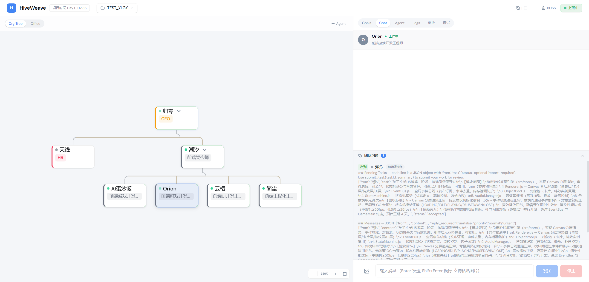

<p align="center">
  <h1 align="center">HiveWeave</h1>
</p>
<p align="center"><strong>AI Engineering Organization</strong> — Multi-Agent Hierarchical Collaborative Platform</p>
<p align="center"><em>Not an AI coding tool. A self-evolving AI engineering organization.</em></p>

<p align="center">
  <a href="https://github.com/kenton-zh/HiveWeave"></a>
  <a href="LICENSE"></a>
  
  
  
</p>

<p align="center">
  <a href="README.md">English</a> |
  <a href="README.zh.md">中文</a>
</p>

[](https://github.com/kenton-zh/HiveWeave)

---

**[What is HiveWeave](#what-is-hiveweave) · [Quick Start](#quick-start) · [Architecture](#architecture) · [Core Capabilities](#core-capabilities) · [Tech Stack](#tech-stack) · [Features](#features) · [Docs](#documentation)**

---

## What is HiveWeave

HiveWeave replaces the single-AI-agent model with a **multi-agent engineering organization**. Instead of one AI doing everything, you get a CEO, managers, engineers, QA, and HR — each with their own role, memory, tools, and worktree. They hire, delegate, review, merge, and report. You manage them like a real team.

> **Why**: Single-agent tools (Claude Code, Codex, Cursor) lose context across modules, can't parallelize, and have no quality gate. HiveWeave splits the work across specialized agents with isolated contexts, independent worktrees, and a four-layer review chain before anything reaches you.

|  | Single-agent tools (Claude Code, Cursor, Codex) | HiveWeave |
|:---|:---|:---|
| **Context** | One shared context, degrades as the codebase grows | Per-agent context — the frontend agent never loads backend code |
| **Parallelism** | One task at a time | Parallel agents, each on its own `git worktree` |
| **Quality gate** | You review everything yourself | 4-layer review: Executor → QA → Manager → CEO → you |
| **Cost model** | Same model for every task | Premium models for decisions, cheap models for execution |
| **Memory** | Reset or manually re-primed each session | Three-tier memory with handoff inheritance between agents |

## Quick Start

**Prerequisites:** Python ≥3.12, Node 22.x (see `.nvmrc`), [pnpm](https://pnpm.io) 10, [uv](https://github.com/astral-sh/uv), and an API key for at least one LLM provider.

```bash
# 1. Clone
git clone https://github.com/kenton-zh/HiveWeave.git
cd HiveWeave

# 2. Configure your API key
cp apps/hiveweave-py/.env.example apps/hiveweave-py/.env
# edit apps/hiveweave-py/.env and set HIVEWEAVE_OPENCODE_API_KEY
# (add OpenAI / Anthropic / DeepSeek / Groq / Google keys later from in-app Settings)

# 3. Backend (Python/FastAPI, port 4000)
cd apps/hiveweave-py
uv sync
uvicorn hiveweave.main:app --host 127.0.0.1 --port 4000
# NOTE: --host 127.0.0.1 binds to loopback only (safe default).
# For LAN access, explicitly set --host 0.0.0.0 AND set HIVEWEAVE_API_KEY.

# 4. Frontend (React/Vite, port 5173) — in a new terminal
cd apps/web
pnpm install
pnpm dev
```

Open `http://localhost:5173` to create your first project and meet your CEO.

**On Windows**, `start-all.bat` / `start-backend.bat` / `start-frontend.bat` run steps 3–4 for you — just make sure Node is on `PATH` first.

## Architecture

```
You (Human Operator)
  ↕                    ↕ (via question tool / chat)
CEO ─── Expert (on-demand, most expensive model)
  ↕
Tech Lead / PM / Architect
  ↕
QA + Executor (cheaper models for execution)

Four-Layer Review Gate:
  Executor → QA(/review) → Tech Lead(spec compliance) → CEO(intent fit) → You(eye check)
```

| Layer | Role | Model | Responsibility |
|:---|------|:---|------|
| Decision | CEO | Premium | Direction, spec, user reporting |
| Planning | Tech Lead | Strong | Architecture, task breakdown, review |
| Quality | QA | Moderate | Five-axis code review, security audit, E2E testing |
| Execution | Executor | Cheap | Write code, run tests, self-review |

## Core Capabilities

### Multi-Agent Organization
- **Dynamic hierarchy** — CEO → HR → Managers → Executors. Coordinators plan and review; Executors write code. Never the other way around.
- **Hiring flow** — CEO designs org → HR hires → Managers break down domains → HR hires more. Three-wave staffing that matches real team growth.
- **Discipline suites** — Each role gets a discipline skill set (code-review-and-quality, self-review, security-and-hardening, etc.) that defines HOW they think, not just WHAT tools they use.
- **Two-tier skill binding** — Discipline skills (mandatory, role-defining) + Tool skills (marketplace-matched by HR). HR serves every coordinator, not just the CEO.

### Context Isolation
- **Per-agent context** — Frontend agent only loads frontend code. Backend agent only loads backend. No cross-contamination.
- **Per-agent model routing** — CEO uses Claude Opus. Executor uses DeepSeek Flash. Expensive tokens on decisions; cheap tokens on execution.
- **Direct chat** — You can talk directly to any agent at any level. Frontend issue? Talk to the frontend dev. Don't route through CEO.

### Git Worktree Development
- **Isolated worktrees** — Each agent gets its own `git worktree` (`hw/<shortId>/<task>`). No conflicts between parallel agents.
- **Checkpoint + rollback** — Agents checkpoint before risky changes. Rollback without polluting main.
- **Review → Merge gate** — Executor reports completion → QA reviews → Manager approves → CEO signs off → Merge to main. Four gates before code reaches you.

### Memory & Handoff
- **Three-tier memory** — Project memory (shared), Agent memory (private), Archived memory (former agents). Knowledge persists across sessions.
- **Handoff inheritance** — When an agent is dismissed, their memory is summarized and transferred to a successor. No knowledge loss.
- **Continuous learning** — Agents can `skillify` successful workflows and `learn` from failures. Cross-project patterns captured for reuse.

### Model Budget Layering
- **Role-based model assignment** — Coordinators get premium models for planning and review. Executors get cheap models for coding.
- **Expert channel** — When the team hits a wall, CEO summons an Expert agent running the most expensive model. AI-refined questions get better answers per dollar.
- **Configurable** — Each agent can individually override its model. Mix providers across OpenAI, Anthropic, DeepSeek, Groq, etc.

### Real-time Dashboard
- **Org chart** — React Flow-powered visualization. Drag, zoom, see who reports to whom.
- **Multi-panel chat** — Talk to multiple agents simultaneously.
- **Live streaming** — Token-level streaming via WebSocket. Watch agents type in real-time.

## Tech Stack

| Layer | Stack | Notes |
|:---|------|------|
| Backend | Python 3.12 + FastAPI + Uvicorn | Port 4000, 122 routes, 16 API modules |
| Frontend | React 19 + Vite + React Flow + Zustand | Port 5173, Electron desktop support |
| Database | SQLite + aiosqlite | Dual-DB: Meta DB (WAL) + Per-project DB |
| AI/LLM | httpx SSE streaming + Provider Factory | OpenAI, Anthropic, DeepSeek, Groq, Google |
| Realtime | phoenix.js + phoenix_adapter (WebSocket) | 3 channels: lobby, project, agent |
| Sandbox | Docker (optional) | `BASH_SANDBOX=docker` |
| Package | pnpm 10 + uv | Monorepo + Python packages |

## Project Structure

```
hiveweave/
├── apps/
│   ├── hiveweave-py/                  # Backend — Python/FastAPI (port 4000)
│   │   └── src/hiveweave/
│   │       ├── agents/                # Agent lifecycle + Supervisor + trigger
│   │       ├── api/                   # 16 FastAPI router modules, 122 routes
│   │       ├── llm/                   # Streamer, provider factory, retry, circuit_breaker
│   │       ├── services/              # 23 services (org, dispatch, memory, handoff, MCP, ...)
│   │       ├── tools/                 # 74 built-in tools (bash, file, grep, patch, review, ...)
│   │       ├── conversation/          # Token budget, compaction, conversation store
│   │       ├── db/                    # Meta DB + Per-project DB (aiosqlite)
│   │       ├── realtime/              # phoenix_adapter, channels, pubsub, event_bus
│   │       └── prompts/               # ETHOS prompt system (identity + context)
│   └── web/                           # Frontend — React 19 + Vite + Electron (port 5173)
├── assets/
│   └── screenshots/                   # Screenshots for README
├── start-all.bat                      # Windows startup script
└── CLAUDE.md                          # AI tooling instructions
```

## How It Works

```
1. Create project → CEO + HR auto-generated
2. CEO explores (EXPLORE) → reads docs → selects org paradigm → designs discipline suites
3. CEO → HR: "Hire a backend tech lead, discipline: Manager Suite"
4. HR: binds discipline skills (mandatory) → searches marketplace for tool skills → creates agent
5. Tech Lead onboarded → EXPLOREs their domain → breaks down tasks → hires subordinates via HR
6. Executor writes code → self-review → QA review → Manager approval → CEO intent check → Your eye check
7. After each visible node passes → next batch of tasks
```

## Features

| Feature | Description |
|:---|------|
| **Role-based models** | CEO/Expert get premium LLMs; Executors get cheap ones. Cost-effective at scale. |
| **Per-agent model override** | Any agent can individually specify its model. Mix providers — OpenAI, Anthropic, DeepSeek, Groq. |
| **Git worktree per agent** | Every agent gets its own `git worktree` (`hw/<shortId>/<task>`). Full filesystem isolation. Checkpoint, rollback, merge — all through the coordinator. |
| **Self-review before QA** | Executors run five-axis self-review (correctness/readability/architecture/security/performance) BEFORE submitting. Catches issues early, reduces review churn. |
| **4-layer review gate** | Executor → QA → Manager → CEO → You. Nothing reaches you unverified. |
| **Natural language user involvement** | Not an enum dropdown. "I only verify after frontend features are done. Backend — I don't want to see it." CEO interprets and honors your intent. |
| **Agent personalities** | Every agent has a 花名 (Chinese poetic nickname), personal backstory, quirks, and hobbies. They feel like characters, not functions. |
| **Discipline suites** | Roles get discipline skill sets that define HOW they think, not just WHAT tools they use. Pre-built suites (QA Suite, Manager Suite, Executor Suite) or CEO-designs-custom. |
| **Two-tier skill binding** | Discipline skills (mandatory, role-defining) + Tool skills (HR matches from marketplace). HR serves every coordinator, not just the CEO. |
| **6 org paradigms** | Solo, Flat Squad, Tech Lead, PM+Architect, Pod, Pipeline. CEO picks the structure that fits the project. |
| **Phase 0.5 manager mobilization** | Managers explore their domain and break down tasks BEFORE hiring subordinates. No over-hiring, no idle agents. |
| **CAVEMAN comms** | Agent-to-agent messages are terse and technical. "模块已拆分. 3人已招. 等待优先级." No pleasantries, zero token waste. |
| **Three-tier memory** | Project memory (shared), Agent private memory, Archived memory (former agents). Knowledge persists across sessions and handoffs. |
| **Handoff inheritance** | When an agent is dismissed, their memory is summarized and transferred to a successor. No knowledge loss. |
| **Expert on-demand** | When the team hits a wall, CEO summons an Expert agent (most expensive model). Team-refined questions → better answers per dollar. Only burns expert tokens when truly needed. |
| **Asyncio task isolation** | Each agent runs in its own asyncio task. Crash doesn't crash the system. Circuit breaker + exponential backoff for LLM outages. |
| **Game time scheduling** | 1 real hour = 1 game day. Stalled agents: 10min stall → nudge, ~40min+ → escalate to superiors. Timed alarms on simulated clock. |
| **Dual-DB pattern** | Meta DB (WAL, global) + Per-project DB (WAL, isolated). Agents never cross-contaminate data. |
| **MCP protocol** | Tool extension via Model Context Protocol. Bind MCP servers per agent — different agents get different external tools. |
| **skills.sh marketplace** | Remote skill marketplace. HR searches and binds skills dynamically. No hardcoded skill lists. |
| **74 built-in tools** | bash, grep, file ops, patch, websearch, question, todowrite, review (5-axis), security audit, MCP tools. Permission-gated per role type. |

## Documentation

- [CLAUDE.md](./CLAUDE.md) — AI tooling instructions & full architecture reference

## Acknowledgments

HiveWeave builds on ideas, code, and workflows from these projects:

| Project | What We Took |
|:---|------|
| **[OpenCode](https://github.com/anomalyco/opencode)** | LLM streaming architecture, token estimation (4 chars/token), conversation compaction, tool output truncation, circuit breaker pattern. The P0 reference for all core logic. |
| **[gstack](https://github.com/garrytan/gstack)** | Engineering workflow discipline system — `/spec` `/plan-eng-review` `/review` `/qa` `/ship` pipelines. Adapted into HiveWeave's **discipline suite** model for agent role definition. Skill routing rules and ETHOS principles also originated here. |
| **[FastAPI](https://github.com/fastapi/fastapi)** | Web framework with first-class WebSocket/SSE support. |
| **[React Flow](https://github.com/xyflow/xyflow)** | Org chart visualization engine. |

> **Standing on shoulders**: Every project listed here solved a hard problem we didn't have to solve again. We assembled, adapted, and layered multi-agent coordination on top.

## Contributing

HiveWeave is in active development and built largely by its own AI agent team (CEO + org), with human review at key checkpoints — see [CLAUDE.md](./CLAUDE.md) for that workflow if you're driving it through Claude Code or a similar coding agent.

Human contributions are just as welcome: open an issue for bugs or ideas, or fork and send a PR. No special process required.

---

<p align="center">
  Built with HiveWeave — an AI engineering organization that builds itself.
</p>
